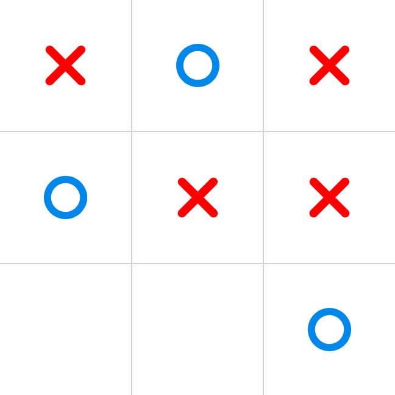

# Tic Tac Toe AI

In 1993, Kevin Crowley and Robert S. Siegler devised a [strategy](http://en.wikipedia.org/wiki/Tic-tac-toe#Strategy) for playing a perfect game of Tic Tac Toe. This project is a JavaScript implementation of that strategy. You can play—and _try_ to beat it—in this nice [web interface](http://cesarfigueroa.org/tic-tac-toe/).

---

**Note:** This game uses many modern technologies, such as `calc` and viewport units in CSS and `classList` in JavaScript. Therefore, you should run it in a modern browser that supports CSS3 and ES5. Unless, you don’t want to play. In which case, feel free to use IE6 :blush:
